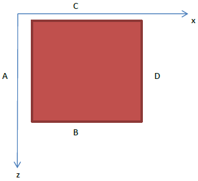
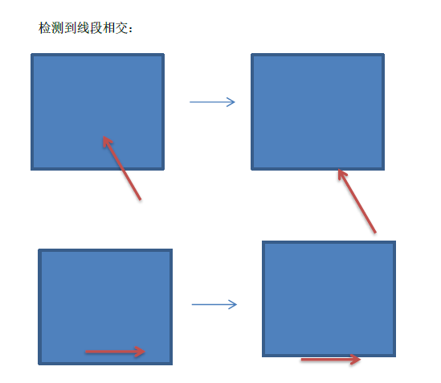
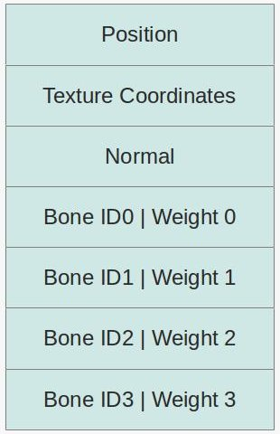
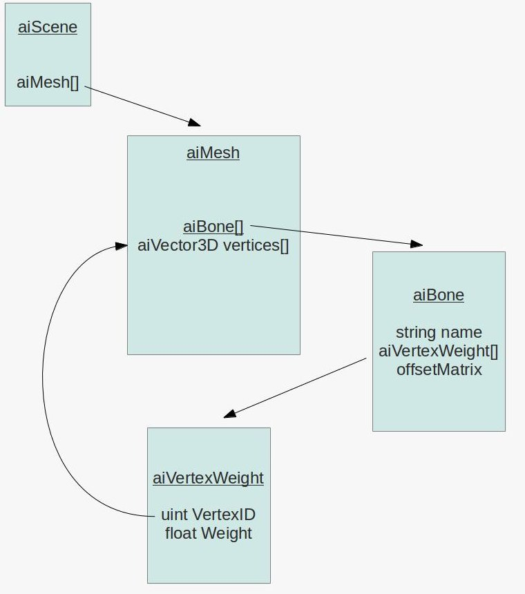

# 项目技术报告

计算机图形学21小组

---

[TOC]

## 项目背景

​	在与世隔绝的蓬莱仙岛上有一只凤凰，凤凰已经在祭台中沉睡千年。在一个月黑风高夜，凤凰苏醒，不停地围绕着蓬莱仙岛飞行，似乎预示着大难的降临......

## 开发环境

|         开发环境          | 第三方库 |
| :-----------------------: | :------: |
|        Windows 10         |  Assimp  |
| Visual Studio 2015 (v140) | freeglut |
|          VsCode           |    GL    |
|            x64            |   GLFW   |
|                           |   glm    |

## 实现功能列表

|            Basic            |                 Bonus                  |
| :-------------------------: | :------------------------------------: |
|       Camera Roaming        |                Sky Box                 |
| Simple lighting and shading | Gravity System and Collision Detection |
|       Texture mapping       |           Skeletal Animation           |
|       Shadow mapping        |            Particle System             |
| Model import & Mesh viewing |                                        |
|                             |                                        |
|                             |                                        |

## 功能点介绍

### Basic

#### Camera Roaming

**实现的功能**

- 能够根据键盘的输入移动凤凰，并跟随凤凰移动；
- 用鼠标控制凤凰的角度时，摄像机的角度也会跟着变化；
- 滚动鼠标的轮子，能够放大或缩小视野。

**实现的难点**

​	在摄像机跟随凤凰的角度变化时，需要保证摄像机始终在凤凰的后方。这时就不能够简单的仅仅是根据凤凰的位置再向后平移某长度的距离这么简单。需要根据凤凰旋转的角度，计算出此刻凤凰所正对的方向，然后再在计算出的方向上，乘需要与凤凰保持的距离。

```cpp
// Calculate the new Front vector
glm::vec3 front;
front.x = cos(glm::radians(Yaw)) * cos(glm::radians(Pitch));
front.y = sin(glm::radians(Pitch));
front.z = sin(glm::radians(Yaw)) * cos(glm::radians(Pitch));
Front = glm::normalize(front);

// Calculate the new position of the camera
currentCamera->Position = Position - Front * 80.0f + glm::vec3(0.0f, 20.0f, 0.0f);
```

#### Texture mapping

**实现的功能**

- 能够将贴图附在模型上
- 能够将部分贴图的背景去除

**问题&&优化**

- 贴图过程中遇到了有的贴图的背景色没有去除

  

  后来在优化的时候加入了**丢弃片段**的技术，就是贴图的纹理其实是`RGBA`的色彩，但是`OpenGL`在默认情况下是不能够识别到透明度的，因此需要用启用这一功能。

  ```cpp
  switch (nrComponents) {
      case 1:format = GL_RED; break;
      case 3:format = GL_RGB; break;
      case 4:format = GL_RGBA; break;
  }
  glBindTexture(GL_TEXTURE_2D, textureID);
  // 启用RGBA的贴图模式
  glTexImage2D(GL_TEXTURE_2D, 0, format, width, height, 0, format, GL_UNSIGNED_BYTE, data);
  glGenerateMipmap(GL_TEXTURE_2D);
  // 在RGBA的情况下将纹理的环绕方式设置为GL_CLAMP_TO_EDGE：
  if (format == GL_RGBA) {
      glTexParameteri(GL_TEXTURE_2D, GL_TEXTURE_WRAP_S, GL_CLAMP_TO_EDGE);
      glTexParameteri(GL_TEXTURE_2D, GL_TEXTURE_WRAP_T, GL_CLAMP_TO_EDGE);
  }
  else {
      glTexParameteri(GL_TEXTURE_2D, GL_TEXTURE_WRAP_S, GL_REPEAT);
      glTexParameteri(GL_TEXTURE_2D, GL_TEXTURE_WRAP_T, GL_REPEAT);
  }
  glTexParameteri(GL_TEXTURE_2D, GL_TEXTURE_MIN_FILTER, GL_LINEAR_MIPMAP_LINEAR);
  glTexParameteri(GL_TEXTURE_2D, GL_TEXTURE_MAG_FILTER, GL_LINEAR);
  ```

   在启用以后，在片段着色器的`shader`中还需要根据透明度的值来抛弃片段。

  ```c
  void main() {
      vec4 texColor = texture(texture_diffuse1, TexCoords);
      if(texColor.a < 0.1)
          discard;
      FragColor = texColor;
  }
  ```

  优化以后的效果如下图所示：

  
  
#### Model import

**实现的功能**

- 把静态的.obj模型导入到项目
- 读取模型带有的纹理信息，在渲染模型时把纹理信息赋予模型
- 把带有骨骼及动画信息的.fbx模型导入项目中

**实现原理**

- 定义mesh类，储存网格的顶点数据（位置向量、法向量、纹理坐标）
- 定义model类，储存模型的mesh及testure信息
- 利用模型导入库是Assimp，将所有的模型数据加载至Assimp的通用数据结构中
- 从Assimp的数据结构中提取所需的数据，储存到自己定义的model类中
- 最后根据已有的数据进行模型的渲染

### Bonus

#### Gravity System and Collision Detection

**实现的功能**

- 能够将凤凰（玩家）控制在地图范围内；
- 设置了**部分**陆地和岩石的碰撞，使得玩家不能够穿过**部分**的墙和陆地。

**完成度**

- 重力系统能够正常使用，但由于后面改用飞翔在天空中的凤凰，因此重力系统没有应用在本场景内，保留了重力系统的代码；
- 碰撞系统实现的时AABB碰撞，在设置包围盒的时候没有所有陆地都设置，并且由于是用矩形盒子包围，因此对于凹凸不平的路面在包裹的时候比较粗糙。

**实现原理**

1. 外部边缘碰撞检测：就是当物体走出边界的视点再放回界面内，再调整物体的位置。

   > PhysicsEngine.cpp
   >
   > Line 46~89
   >
   > void PhysicsEngine::checkOutsideCollisionXZ(glm::vec3 & cameraPos, glm::vec3 & targetPos)

2. 内部边缘碰撞检测：当物体处于碰撞体垂直区域范围内，进行**外部边缘碰撞检测**碰撞检测，既检查是否触碰到包围盒子的边界。而内部边缘的碰撞检测需要用到**线段相交快速算法**，以及利用**相似三角形**进行`camera`视点、目标点的调整。 

   在内部碰撞的时候一般有八种情况：

   - 当视线与A面线段相交，前进碰撞A面或后退碰撞A面
   - 当视线与B面线段相交，前进碰撞B面或后退碰撞B面
   - 当视线与C面线段相交，前进碰撞C面或后退碰撞C面
   - 当视线与D面线段相交，前进碰撞D面或后退碰撞D面

   由于我们可能在平行的过程中左右移动，这时我们会闯入物体，但是由于移动是离散的，所以我们的视线不一定与物体相交，因此会有另外四种特殊情况：

   - 平行于z轴进入A面
   - 平行于z轴进入D面
   - 平行于x轴进入C面
   - 平行于x轴进入B面

   

   ​	

   ​	当碰撞发生后，我们要做的就是“恢复现场”，也就是说，当视线与边缘相交时，我们把它恢复到恰好不相交的位置，在这个过程中，我们维护角度不发生变化。

   

   > PhysicsEngine.cpp
   >
   > Line 109~111
   >
   > double Direction(glm::vec2 pi, glm::vec2 pj, glm::vec2 pk)
   >
   > Line 114~119
   >
   > bool OnSegment(glm::vec2 pi, glm::vec2 pj, glm::vec2 pk)
   >
   > Line 123~141
   >
   > bool SegmentIntersect(glm::vec2 p1, glm::vec2 p2, glm::vec2 p3, glm::vec2 p4)
   >
   > Line 144~203
   >
   > void PhysicsEngine::checkInsideCollisionXZ(glm::vec3 innerBoundaryMin, glm::vec3 innerBoundaryMax, glm::vec3 & cameraPos, glm::vec3 & targetPos)

3. 重力系统实现原理

   首先我们设置了一系列与重力相关的数值

   ```cpp
   // 由于改用飞行的凤凰，因此重力和跳跃的系数置为零，倘若要检查重力的跳跃的功能，可以手动更改这部分代码，将数值设置为不为零即可
   #define phoenixHeight 1.0f           // 玩家头到脚的高度
   #define GravityAcceleration -9.8f
   #define MoveSpeed 50.0f            // 玩家移动速度
   #define BoundaryGap 0.1f           // 碰撞间距
   #define JumpInitialSpeed 0.0f     // 起跳初速度
   #define JumpFactor 0.0f           // 跳起速度系数
   #define GravityFactor 0.0f        // 下落速度系数
   ```

   然后根据这些影响因子来更新物体的垂直坐标

   ```cpp
   glm::vec3 acceleration = gravity + accelerationUp;
   velocity += acceleration * GravityFactor;
   cameraPos += velocity * JumpFactor;
   targetPos += velocity * JumpFactor;
   ```

   由于还有碰撞系统，因此在更新完垂直坐标后，需要进行检查，检查是否脚接触到碰撞体顶部，或者头接触到碰撞体底部，然后来更新其纵坐标。

   > PhysicsEngine.cpp
   >
   > Line 235~259
   >
   > void PhysicsEngine::updateItemMovement(glm::vec3 & cameraPos, glm::vec3 & targetPos)

**实现步骤**

1. 在加载场景的时候，先为场景需要碰撞检测的地方设置包围盒；
2. 在每次移动了物体以后，都会检测一遍与所有的包围盒是否有碰撞；
3. 检测的方法如原理所说，先在水平方向进行边缘检测；
4. 由于有重力系统，需要在垂直方向更新物体的位置，检测是否碰撞到碰撞盒子的上下沿；
5. 点击空格键跳跃，跳跃时给定一个向上的初速度；

**不足之处**

​	添加碰撞盒子对于不规则的模型来说太繁琐，并且效果很粗糙，这点是不足的。

#### Skeletal Animation

**实现的功能**

- 给定一个带有骨骼动画的模型能够使其动起来

**完成度**

- 凤凰的骨骼动画能够正常播放；
- 骨骼动画播放流畅

**实现原理**

​	骨骼动画事实上有两部分。第一部分是由设计师完成的，而第二部分是程序员完成的。第一部分发生在模型软件中，它被称作骨骼装配`rigging`。在这里，设计师指定了皮肤下的骨架。`mesh`就是指对象的皮肤，而骨骼是用于移动`mesh`以模拟现实世界中的运动。这是通过指定某个点到一块或多块骨头完成的。当一个顶点指定了一个骨头的时候，我们给出在移动中这块骨头对顶点影响的权重。对于每个顶点，实践中要保证权重总和为`1`。

​	我们所看到的骨骼动画实际上是设计师所定义的关键帧的集合，关键帧包含了所有骨头在动画路径上的关键点的变换。 骨骼动画中的骨架结构通常是分层次的，这意味着骨头之间有父子的关系，所以形成了一棵骨头树，除了根节点以外，每个骨头都有一个父节点。 因此，骨骼动画要做的就是将利用这颗骨头树，再结合关键帧集合，计算出每一轮渲染时骨头的位置，然后再根据每个节点受骨头影响的权值，来对`mesh`的位置进行重定位，已达到动画的效果。

​	对于骨骼动画而言，每个顶点的结构看起来是这样子的。



​	骨头的`IDs`是一个骨头变换数组的索引。权值将用于结合不同骨头的变换成为一个变换，在任何情况下，权值总和都应该是`1`。骨头的变换被放置在一个棵树里，树中的每个结点存在一个旋转四元数和一个平移向量。每个结点都包含这些项的一个数组。数组的每一项都应当有一个时间戳。对于从当前骨头到根的每一结点我们完成相同的过程，并且把这一串变换相乘得到最终结果。我们对每个骨头都这么做，然后更新着色器。

​	在读取骨骼信息上，`Assimp`已经有了很好的封装，将模型的数据转化成一棵树，但我们仍然需要自定义一个我们需要的结构，并把数据装载进去。让我们从顶点层次的骨骼信息开始。这是Assimp数据结构中相关的片段：



​	一个`aiBone`代表了骨架下的一块骨头。每个骨头都有一个名称，依靠这个名称它们可以在层次中定位到这块骨头，同时，还有一个顶点权值数组和一个4X4的偏移量矩阵。我们需要将这些信息取出，并在骨骼空间中完成骨骼变换，即将该层到根部的所有偏移向量相乘。

​       顶点权值数组是很重要的信息。数组中的每一项都包含aiMesh顶点数组中的一个索引和一个权值。所有顶点的权值和必须为`1`，但是为了找到它们，你需要遍历所有的骨头并且累加和到每个特定顶点的链表中。在顶点层次创建完可以运行骨骼变换层次以及产生最终变换的骨骼信息后，我们将其加载到着色器。接下来的图片显示了相关数据结构：


​	从`aiScene`开始，`aiScene`对象包含了一个`aiNode`的指针，其中`aiNode`类是分层（树）的根。树上的每个结点都有一个指针指向了它们的父母，一个指针数组指向了它们的孩子。这允许我们方便的来回遍历树。此外，结点还存储了**从结点空间到父空间的变换矩阵**。最后，结点可能有名字，也可能没有名字。如果一个结点代表分层中的一块骨头，那么这个节点的名字必须和骨头对应。但是有时候结点没有名字，这时意味着没有对应的骨头，它们的工作仅仅是帮助建模师分解模型并执行一些中间变换。

​        最后一部分是`aiAnimation`数组，它同样也存储在`aiScene`对象中。一个单一的`aiAnimation`对象代表着一序列动画帧，例如“走路”，“奔跑”，“射击”等等。通过在帧之间插值可以得到如动画名所示的想要的可见效果。另外，一个动画有一个`aiNodeAnim`对象的数组，叫做通道。每个通道事实上包含了其所有变换的骨头。通道包含的名字必须与分层中的一个结点和三个变换数组对应。

​        操作时，需要找到分层中的一个对应结点，然后访问其父亲结点。然后需要到父节点对应的通道，并执行相同的操作。将两个变换相乘，继续如此，直到到达分层的根。

**实现步骤**

1. 用`Assimp`加载模型，读取节点的信息，包括顶点的位置，顶点的法向量，顶点的贴图座标，顶点的骨骼ID和对应的权值，骨骼信息，动画信息等，并储存在自己定义的结构里

   > model.h
   >
   > model.cpp
   >
   > Line 14~254

2. 在每次渲染时从动画信息中找到骨骼的变换矩阵，然后更新每个节点的骨骼的信息，并递归去更新孩子节点的骨骼信息。最后将更新后的骨骼的`finalMatrix`传到`shader`内计算，计算时要考虑每个顶点对于每根骨头的权重，然后计算得到新的顶点位置信息即可。

   > model.cpp
   >
   > Line 323~350
   >
   > void Model::OnDraw()
   >
   > Line 257~320
   >
   > void Model::TransformNode(const char* nodename, int framecount, glm::mat4& parenttransform)

**问题及解决方案**

1. 骨骼动画错乱，形成很鬼畜的骨骼动画。

   ​	在期末展示的时候，我们所展示的功夫熊猫骨骼动画十分鬼畜。后来在换了一个凤凰的模型后，问题得到了解决。应该是熊猫的骨骼动画信息错误导致的。

   ​	但是在后来优化的过程中，又发现骨骼动画开始错乱，这次的原因不是模型的信息有误，而是在更新骨骼信息的时候，重用了`shader`里面的某条`uniform`，导致骨骼信息的错误。解决方法就是把`uniform`的更新顺序放置到每个`mesh`内部进行更新，而不是在外部遍历每个`mesh`进行更新。

2. 执行骨骼动画期间，动画十分卡顿，使得整个软件无法流畅使用。

   ​	由于第一次写骨骼动画的时候，在寻找匹配的骨骼时，采用的是数组遍历对应名字去找，这样的寻找效率大幅度降低。

   ```cpp
   for (size_t meshindex = 0; meshindex < this->meshes.size(); meshindex++) {
       for (size_t boneindex = 0; boneindex < this->meshes[meshindex].bones.size(); boneindex++) {
           bone = this->meshes[meshindex].bones[boneindex];
           if (strcmp(bone.name, nodename) == 0) {
               ...
           }
       }
   }
   ```

   ​	为了解决这个情况，我将骨骼信息用`map`储存起来，并且由每个骨骼的名字来对应具体的数据，在搜索时只需要条用`map`对应的`find`函数即可，红黑树的数据结构加树的搜索效率，使得搜索效率有所提升。但是依然效果不明显，还是会卡顿。

   ​	后来分析了解到，由于节点的更新过程全都放在`CPU`里去执行，结点个数高达一万多个，并且还要遍历所有节点更新位置信息，在遍历一万多个节点的基础上，内部还有两重更新的循环，从而造成卡顿的情况。以下是`CPU`版的骨骼动画更新过程。

   ```cpp
   // 更新Vertex Position;
   for (size_t meshindex = 0; meshindex < this->meshes.size(); meshindex++) {
       for (size_t vertexindex = 0; vertexindex < meshes[meshindex].vertices.size(); vertexindex++) {
           Vertex vertex = meshes[meshindex].vertices[vertexindex];
   
           glm::mat4 boneTransform;
   
           //计算权重;
           glm::mat4 *transform = this->meshes[meshindex].transform;
           for (int weightindex = 0; weightindex < VERTEX_MAX_BONE; weightindex++) {
   
               //Bone bone = this->meshes[meshindex].bones[vertex.boneIDs[weightindex]];
               //boneTransform += bone.finalMatrix * vertex.weights[weightindex];
               boneTransform += transform[vertex.boneIDs[weightindex]] * vertex.weights[weightindex];
           }
   
           glm::vec4 animPosition(vertex.Position, 1.0f);
           animPosition = boneTransform * animPosition;
   
           vertex.animPosition = glm::vec3(animPosition);
           meshes[meshindex].vertices[vertexindex] = vertex;
       }
   }
   ```

   ​	后来的解决方案当然是靠`GPU`来代替我们完成这项工作啦！以下是用来计算更新节点数据的`shader`。我在没个节点多储存了对应的骨头ID以及对应权重的信息，并且把骨骼的信息也加入其中。然后在渲染的时候，`GPU`就会根据一下信息来更新对应顶点的位置。当然，骨骼信息的更新是在渲染之前完成的，这样一来就实现了骨骼动画的`GPU`版本，大大提升了程序的效率。

   ```c
   const int MAX_BONES = 100;
   
   uniform mat4 gBones[MAX_BONES];
   
   void main()
   {
       mat4 BoneTransform;
       BoneTransform = gBones[aBoneIDs[0]]*aWeights[0];
       BoneTransform += gBones[aBoneIDs[1]]*aWeights[1];
       BoneTransform += gBones[aBoneIDs[2]]*aWeights[2];
       BoneTransform += gBones[aBoneIDs[3]]*aWeights[3];
       
       vec4 PosL = BoneTransform * vec4(aPos, 1.0);
       gl_Position = projection * view * model * PosL;
   }
   ```

#### Particle System

**实现的功能**

- 生成一级粒子，作为粒子发射器(火圈的底部)
- 生成二级粒子，作为粒子发射器发射的粒子(实际向上移动的火焰粒子)

**完成度**

- 已实现火圈的粒子效果
- 火圈粒子对资源占用不大

**实现原理**

​	火焰粒子效果主要是依靠几何着色器完成，通过OpenGL提供的混合功能，将具有相同的颜色、不同透明度粒子与图片纹理进行混合，从而形成具有火焰外观的粒子。

对于一个**火焰粒子**，其需要有：

- type：

  用于在几何着色器中区分一级粒子和二级粒子

- position：

  定义粒子的位置

- velocity：

  定义粒子的速度

- lifetimeMills：

  定义粒子当前年龄，当年龄大于等于寿命时，粒子死亡(消失)

- alpha：

  定义粒子的透明度

- size：

  定义粒子的大小

- life：

  定义粒子的寿命，即粒子从出生到死亡的时间间隔

对于一个**火焰粒子系统**，其需要有：

- 最小速度和最大速度：

  使粒子的速度在这个范围内随机获取

- 最小生命周期和最大生命周期：

  使粒子的存在时间在这个范围内随机获取

- 粒子发射系统最大的粒子数：

  粒子系统中包含的粒子数的最大值，小于等于18000(超过则会堆栈上溢)

- 初始化粒子系统时发射粒子数：

  粒子系统初始化时产生的一级发射粒子数

**实现步骤**

1. 定义粒子数据结构和粒子系统宏，用于将结构化数据传输至Shader处理

> Flame.h
>
> - Line 11 ~ Line 38

2. 初始化发射器粒子的中心点的各项属性，用于随机生成其它发射器粒子

> Flame.cpp
>
> - Line 36 ~ Line 66 ：InitFlame(glm::vec3& pos):bool

3. 通过高斯分布初始化其它粒子的位置，并以粒子系统宏随机生成其它属性；随机生成纹理。以上两个步骤用于后续混合纹理。

> Flame.cpp
>
> - Line 174 ~ Line 190：InitRandomTexture(unsigned int size):void
>
>
> - Line 192 ~ Line 218：GenInitLocation(FlameParticle particles[], int nums):void

4. 通过几何着色器(geometry shader)将第3步获取的随机纹理和粒子属性进行混合，从而呈现出透明度不同、纹理不同的火焰粒子。

`Update.gs`：

```c
void main()
{
    float Age = Age0[0] - gDeltaTimeMillis;// 当前年龄
    if(Type0[0] == PARTICLE_TYPE_LAUNCHER){// 火焰发射粒子
        if(Age <= 0 ){
            //发射第二级粒子
            Type1 = PARTICLE_TYPE_SHELL;
            Position1 = Position0[0];
            //与初始发射器一样，在最大和最小速度之间随机
            Velocity1 = (MAX_VELOC-MIN_VELOC)*Rand(Age0[0]).x+MIN_VELOC;
           // 寿命同上
            Age1 = (MAX_LIFE-MIN_LIFE)*Rand(Age0[0]).y + MIN_LIFE;
           // 求当前粒子到圆心的距离，默认中心在原点
            float dist = sqrt(Position1.x*Position1.x + Position1.z*Position1.z);
           // r为火焰中心半径
           if(dist <= r)
                Age1 *= 1.3;// 火焰的寿命在中心长一点，边缘短
            Life1 = Age1;// 寿命与当前距离的最大年龄相等
            Alpha1 = Alpha0[0];
            Size1 = Size0[0];
            EmitVertex();
            EndPrimitive();// 返回结果
            Age = (MAX_LIFE-MIN_LIFE)*Rand(Age0[0]).z + MIN_LIFE;// 年龄在最大/最小寿命之前随机取得
        }
        // 中心发射器粒子直接设为主程序指定的值
        Type1 = PARTICLE_TYPE_LAUNCHER;
        Position1 = Position0[0];
        Velocity1 = Velocity0[0];
        Age1 = Age;
        Alpha1 = Alpha0[0];
        Size1 = Size0[0];
        Life1 = Life0[0];
        EmitVertex();
        EndPrimitive();// 返回结果
    } 
    //第二级粒子
    else{        
        if(Age >= 0){
            //将时间转为以秒为单位
            float DeltaTimeSecs = gDeltaTimeMillis/1000.0f;
            //求位置的变化量，未考虑重力加速度
            vec3 DeltaP = Velocity0[0]*DeltaTimeSecs;
            vec3 DeltaV = DeltaTimeSecs*vec3(0.0,1.0,0.0);
            Type1 = PARTICLE_TYPE_SHELL;
            Position1 = Position0[0] + DeltaP;
            Velocity1 = Velocity0[0] + DeltaV;
            Age1 = Age;
            Life1 = Life0[0];
            //在粒子生命周期中，一开始比较小，后来增大，然后又减小
            //用当前剩余寿命和全部寿命设置大小和alpha
            float factor = 1.0f/((Age/1000.0f - Life1/2000.0f)*(Age/1000.0f - Life1/2000.0f)+1);   
            Alpha1 = factor;
            Size1 = 55.0*factor;
            EmitVertex();
            EndPrimitive();
        }
    }
}
```

**问题及解决方案**

- 火焰粒子在渲染过程中需要使用混合，如果关闭深度检测进行混合，混合结果良好，混合后重新打开深度检测会导致火焰粒子的深度信息丢失，默认深度最大显示在最前

解决方案：混合过程中保持深度检测打开。


## 小组成员分工

### Basic

|     完成人      |     完成人     | 备注                                                         |
| :-------------: | :------------: | ------------------------------------------------------------ |
| Camera Roaming  |     钟敏欣     | 第一阶段完成了`Camera`类，并且能够自由移动。第二阶段优化`Camera`，使之能够跟随凤凰移动，并且转化角度。 |
| Texture mapping | 李启明&&张子扬 | 李启明完成基本的贴图映射；张子扬增加了丢弃片段优化贴图。     |
|                 |                |                                                              |
|                 |                |                                                              |
|                 |                |                                                              |
|                 |                |                                                              |
|                 |                |                                                              |
|                 |                |                                                              |
|                 |                |                                                              |

### Bonus

|                  模块                  | 完成人 | 备注                                                         |
| :------------------------------------: | :----: | ------------------------------------------------------------ |
| Gravity System and Collision Detection | 张子扬 | 基本完成                                                     |
|           Skeletal Animation           | 张子扬 | 第一阶段实现了`CPU`版本的骨骼动画，后来由于效率原因对其采取优化。第二阶段实现了`GPU`版本的骨骼动画，解决了第一阶段的遗留问题。 |
|            Particle System             | 朱文豪 | 第一阶段实现了粒子系统的生成，移动；后因需求改变取消了粒子系统的移动，并修复了粒子系统深度问题。 |
|                                        |        |                                                              |
|                                        |        |                                                              |
|                                        |        |                                                              |
|                                        |        |                                                              |
|                                        |        |                                                              |
|                                        |        |                                                              |

